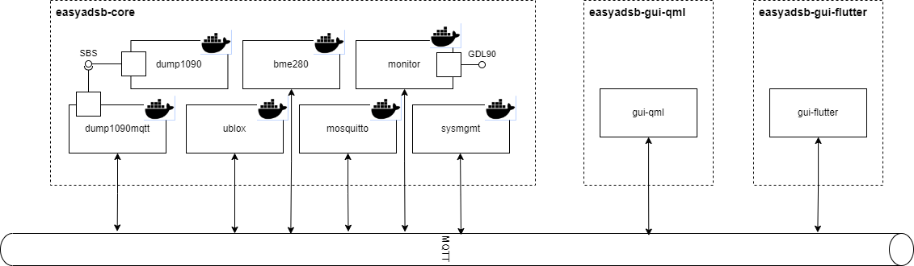

# Easy ADS-B
Project to easily setup your device as a ADS-B receiver

# Setup
- run `./installer_raspberrypi.sh`

# System Design

# MQTT API
## Overview
| Topic | Data | Type | Description |
|---|---|---|---|
| /easyadsb/dump1090/sbs | SBS | notification | Raw ADSB Traffic Messages |
| /easyadsb/bme280/json | json | notification | Environmental Sensor (barometric pressure) |
| /easyadsb/ublox/nmea | NMEA | notification | GNSS |
| /easyadsb/monitor/satellites | json | notification | Satellite Information |
| /easyadsb/monitor/position | json | notification | Position Information |
| /easyadsb/monitor/status | json | notification | Status Information (GDL90) |
| /easyadsb/monitor/traffic | json | notification | Traffic Information |
| /easyadsb/monitor/traffic/ctrl/request | json | request | Control traffic information service |
| /easyadsb/monitor/traffic/ctrl/response | json | response | Control traffic information service |
| /easyadsb/sysmgmt/info | json | notification | System Information (WiFi, CPU) |
| /easyadsb/sysmgmt/ctrl/request | json | request | control system settings |
| /easyadsb/sysmgmt/ctrl/response | json | response | control system settings |

## SBS notification
SBS-1 Basestation Protocol. Message format documentation: [http://woodair.net/SBS/Article/Barebones42_Socket_Data.htm](http://woodair.net/SBS/Article/Barebones42_Socket_Data.htm)

Example: `MSG,3,1,1,44039E,1,2023/10/26,07:20:11.481,2023/10/26,07:20:11.491,,30500,,,,,,,0,,0,0
`

## NMEA notification
NMEA Strings. More Info: [https://www.gpsworld.com/what-exactly-is-gps-nmea-data/](https://www.gpsworld.com/what-exactly-is-gps-nmea-data/)

Currently used Message IDs are **GSV, GSA, VTG & GGA**

Example: `$GNGGA,072015.00,,,,,0,00,99.99,,,,,,*79`

## BME280 json notification
json objects containing the following fields
- humidity, rel. Hum. %, decimal
- pressure, hPa, decimal
- temperature, °C, decimal
- pressureAltitude, m.s.l., decimal

Example: `{"humidity": 33.336, "pressure": 905.348, "temperature": 27.854, "pressureAltitude": 1002.566}`

Pressure Altitude calculation uses 1013.25 hPa as reference pressure and compensates for temperature.
More Info: [https://en.wikipedia.org/wiki/Pressure_altitude](https://en.wikipedia.org/wiki/Pressure_altitude)

## satellites notification
JSON array with satellite objects. satellite object has fields:
- `svid`, satellite id
- `prn`, satellite PRN number
- `elevation`, position in sky
- `azimuth`, position in sky
- `cno`, signal strength
- `used`, true if used for navigation

Example notification: `[{"svid": 79, "prn": "R15", "elevation": null, "azimuth": null, "cno": 23, "used": false}]`

## position notification
JSON object with fields
- `navMode`
- `opMode`
- `pdop`
- `hdop`
- `vdop`
- `trueTrack`
- `magneticTrack`
- `groundSpeedKnots`
- `groundSpeedKph`
- `latitude`
- `longitude`
- `altitudeMeter`
- `separationMeter`
- `utcTime`
- `temperature`
- `humidity`
- `pressure`
- `pressureAltitude`

Example notification: `{"navMode": 1, "opMode": "A", "pdop": 99.99, "hdop": 99.99, "vdop": 99.99, "trueTack": null, "magneticTrack": null, "groundSpeedKnots": null, "groundSpeedKph": null, "latitude": null, "longitude": null, "altitudeMeter": null, "separationMeter": null, "utcTime": "10:03:46", "temperature": 29.588, "humidity": 31.851, "pressure": 905.72, "pressureAltitude": 1004.625}`

## status notification
JSON object with fields:
- `gdl90`, object
    - `isActive`
    - `ip`
    - `netmask`
    - `broadcastIp`
    - `nic`
    - `port`

Example notification `{"gdl90": {"isActive": true, "ip": "172.20.10.7", "netMask": "255.255.255.240", "broadcastIp": "172.20.10.15", "nic": "wlan0", "port": 4000}}`

## traffic ctrl

Available commands are 
- `clearHistory`, removes unseen traffic, no data
- `setAutoCleanup`, automatically remove unseen traffic, data: `{ "enabled" : true/false}`
- `setCallsignFilter`, callsign to filter out of traffic (own aircraft), data `{ "callsign" : "string" }`

Example request: `{"command": "clearHistory", "data": {}, "requestId": "2f0f975e-73e5-11ee-b6c7-dca632add617"}`

Example response: `{"success": true, "data": null, "requestId": "2f0f975e-73e5-11ee-b6c7-dca632add617"}`

## system info

Example notification: `{"wifi": {"ssid": "Blabla", "frequency": 2.437, "accesspoint": "xx:xx:xx:xx:xx:xx", "linkQuality": 1.0, "signalLevel": -26.0}, "wifilist": [{"ssid": "Blabla", "state": "known", "isConnected": true, "frequency": 2.437, "accesspoint": "xx:xx:xx:xx:xx:xx", "linkQuality": 1.0, "signalLevel": -26.0, "isEncrypted": true}, {"ssid": "Blabla2", "state": "new", "isConnected": false, "frequency": 5.2, "accesspoint": "xx:xx:xx:xx:xx:xx", "linkQuality": 0.357, "signalLevel": -85.0, "isEncrypted": false} ], "resources": {"memTotal": 1893596, "memFree": 74312, "swapCached": 38668, "cpuTemp": 73.036, "cpuUsage": 0.0}}`

## system ctrl

Available commands are
- `forceReconnect`
- `addWifi`
- `removeWifi`
- `saveChanges`

Example request: `{"command": "forceReconnect", "data": {}, "requestId": "4dfb87a8-73e6-11ee-b6c7-dca632add617"}`

Example response: `{"success": false, "data": null, "requestId": "4dfb87a8-73e6-11ee-b6c7-dca632add617"}`

# GDL90
Garmin Datalink. Connect compatible devices to this interface to get traffic informatin. 
E.g. Mobile Devices running Sky Demon can be connected to this interface.
Protocol Spec: [https://www.faa.gov/sites/faa.gov/files/air_traffic/technology/adsb/archival/GDL90_Public_ICD_RevA.PDF](https://www.faa.gov/sites/faa.gov/files/air_traffic/technology/adsb/archival/GDL90_Public_ICD_RevA.PDF)

